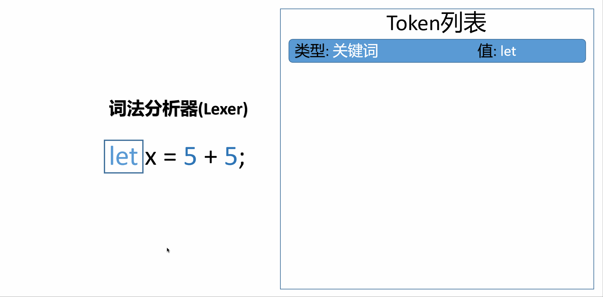

编译器分为前端和后端，但有别于传统的Web项目，编译器的前端一般承担着词法分析、语法分析、类型检查等工作，而后端主要负责将代码翻译成目标机器能够运行的二进制机器码。本系列制作的是一门**解释型语言(Interpreted Language)**,本节主要介绍编译器前端中的 **词法分析(Lexical Analysis)** 阶段。  
  

## “处理”源码
> In order for us to work with source code we need to turn it into a more accessible form.  
  

首先我们需要明白一件事:机器是无法理解我们平时写的源代码的，它只能够理解二进制数据，而从源码转化为二进制这一行为叫做编译(compile)，执行这一过程的程序叫做编译器(compiler),你可以将源代码理解为英文，最终的二进制数据(程序)理解为中文，那么编译器就是翻译员。不同的是，编译这个行为并不是一步到位的，中间又分为许多步骤，下面让我们调整视角，来关注编译的第一步：词法分析。  
   


词法分析器(Lexer)的输入就是我们的源代码(source code)，输出token并将其作为语法分析的输入。  
假设我们有这样一行源代码:
```
let x = 5 + 5;
```
经过词法分析后，我们期望它成为类似下面这种格式的标记(token)
```
[ 
    LET, 
    IDENTIFIER("x"), 
    EQUAL_SIGN, 
    INTEGER(5), 
    PLUS_SIGN, 
    INTEGER(5), 
    SEMICOLON 
]
```
稍加留意就会发现，这一步做的工作其实就是将源代码“拆开”转化为一个一个对应的标记，这样更加方便下一阶段处理。  

  

其伪代码可以这样表示:
```java

// 源代码
var input = "let x = 5 + 5;"

// 将源代码作为词法分析器的输入
Lexer lexer = new Lexer(input)

// 调用词法分析器的nextToken方法，该方法返回下一个token
for (var tok = lexer.nextToken(); tok != EOF; tok = lexer.nextToken()) {
    Print(tok)
}
```

而词法分析器的代码如下:

```java
// 词法分析器
class Lexer {
    // nextToken返回下一个token对象,只需要不断调用nextToken即可
    Token nextToken() {
        // 读一个字符
        var ch = readChar()
        // 判断该字符是否是加减乘除等符号，是的话就返回对应的Token
        if (ch == '+') {
            return new Token(Token.PLUS, ch)
        } else if (ch == '-') {
            return new Token(Token.MINUS, ch)
        } ... {
            // 加减乘除左右大中小括号等
        } else {
            // 执行这里说明当前字符可能是字母,也可能是数字
            if (ch.isLetter()) {
                // 如果是字母,读完这个单词(一直到空格)再进一步处理
                readWord()
                ...  
                
            } else if (ch.isDigit()) {
                // 如果是数字同上,读完这个数字,将其作为整数对待
                readNumber()
                ...

            }
        }
    }
}
```  
以上代码只给出了词法分析器的核心思路，你可以自己去完善它，修改它。

你可以使用下面这段代码当做你自己的词法分析器的输入作为测试用例，当然你也可以创造自己的编程语言词法规则。  
```javascript
let five = 5;
let ten = 10;

let add = fn(x, y) {
  x + y;
};

let result = add(five, ten);
```

## 思考
Lexer里的ch是一个byte类型的数据结构,一次只能判断一个字符,那如果我们遇到像`==`或`let`这样的多个字符该如何处理呢?试试实现吧。完整代码在[github](https://github.com/kimmosc2/monkey-interpreter/blob/master/lexer/lexer.go#L45)上。


> 本文可以看做 [《Writing An Interpreter In Go》](https://compilerbook.com/) 一书读后感,我找了很久没发现这本书的中文版本，自己也是啃的英文原版。链接放在下面了，有能力请支持正版，侵删。  
>   
> 链接：[https://pan.baidu.com/s/1VaMJV3DjuewTVVU-kjqdig](https://pan.baidu.com/s/1VaMJV3DjuewTVVU-kjqdig)   
提取码：butn